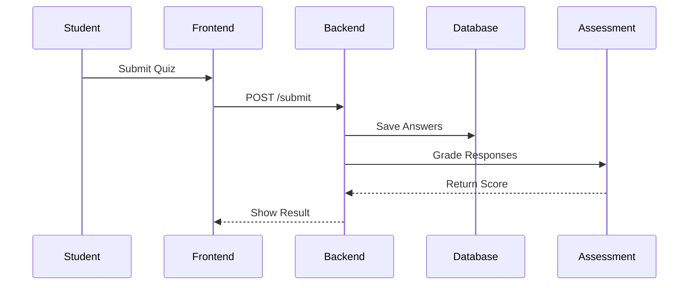

# MERN Quiz Management System (QMS) - Enterprise Edition

A robust, microservices-based Quiz Management System built with the MERN stack. Features advanced security, role-based access control, and a premium glassmorphic UI.

## 📁 Architecture Overview

- **`client/`**: Vite + React frontend with Framer Motion and React Hot Toast.
- **`server/`**: Scalable microservices backend.
  - **API Gateway (8002)**: Unified entry point for all client requests.
  - **Auth Service (5001)**: User lifecycle, JWT issuance, and validation.
  - **Quiz Service (5002)**: Assessment creation, management, and CRUD operations.
  - **Assessment Service (5003)**: Real-time submission handling and partial-credit grading.
  - **Reporting Service (5004)**: Analytics and automated PDF report generation.

## 🛠️ Prerequisites

- **Node.js**: v18.0.0 or higher
- **MongoDB**: A running local instance or MongoDB Atlas cluster.
- **NPM**: v9.0.0 or higher

## 🚀 Quick Start (Recommended)

Run the following command in the **root directory** to install all dependencies and start the entire ecosystem (all 4 services + client) concurrently:

```bash
# Install everything
npm install && npm run install-all

# Start everything
npm run dev
```

The application will be live at:
- **Frontend**: [http://localhost:5173](http://localhost:5173)
- **Auth API**: [http://localhost:5001/api/auth](http://localhost:5001/api/auth)
- **Quiz API**: [http://localhost:5002/api/quizzes](http://localhost:5002/api/quizzes)

## 📦 Manual Installation

If you prefer to install components individually:

### 1. Root & Orchestration
```bash
npm install
```

### 2. Microservices (Repeat for each folder in /server)
```bash
cd server/[service-name]
npm install
```

### 3. Frontend Client
```bash
cd client
npm install
```

## ⚙️ Configuration

Each service requires a `.env` file. We have pre-configured these for local development, but you should update the `MONGO_URI` and `JWT_SECRET` for production environments.

**Required Keys:**
- `MONGO_URI`: Your MongoDB connection string.
- `PORT`: Service port (5001-5004, 8002 for Gateway).
- `JWT_SECRET`: A secure string for token signing (must be identical across all services).
- `CLIENT_URL`: The URL of your frontend (e.g., `http://localhost:5173`).

## 🛡️ Security Features
- **Rate Limiting**: Protects APIs from brute-force attempts.
- **Helmet**: Secures HTTP headers.
- **Joi Validation**: Ensures strict data integrity for all incoming requests.
- **Protected Routes**: Role-based access control for Students and Instructors.

## 📊 Appendix A: Sequence Diagram (Quiz Submission)




## 📱 Appendix B: UI Overview & Mockups

### 6.1 UI Overview
- **Instructor View**: Quiz creation wizard, analytics dashboard.
- **Student View**: Quiz timer, submission portal, results history.

### 6.2 Mockup Diagrams Description
1.  **Login Screen**: Clean, glassmorphic login form with role selection (optional if auto-detected).
2.  **Quiz Dashboard**:
    - *Student*: List of available quizzes with "Start Quiz" buttons.
    - *Teacher*: List of created quizzes with "Edit" and "Analytics" options.
3.  **Question Editor**: WYSIWYG editor for adding questions, options, and selecting correct answers.

| UI Element | Action |
| :--- | :--- |
| **"Start Quiz" Button** | Begins timed assessment |
| **"Save Draft" Button** | Stores incomplete quiz for later |
| **"View Report" Link** | Displays performance analytics |
